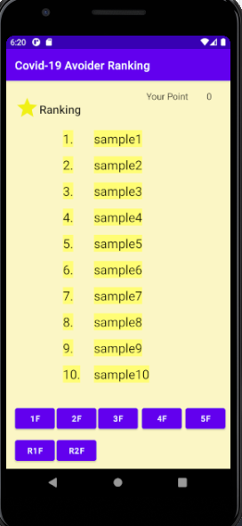

# FunLocks2020年 アピールシート

### プロダクト名
アボランク

### コンセプト
コロナ禍で大学生たちが積極的に密を避けるようにするようなプロダクトを提供したいと考えた。大学からの学内メールによる注意も定期的に行われるが、あまり効果を実感できなかったため、ほかの手段による注意喚起と意識向上を行えればいいと思った。

### 対象ユーザ
未来大生、はこだて未来大学の職員

### どうやって利用するか
大学内でアプリを開くと、beaconからの電波を検知して、それをもとに密の度合いを視覚化する。危険の度合いは色で表示。そして、密を避けた分だけポイントがたまる。ポイントの計算方法は15分ごとに半径1.5m以内の端末が二台以下であれば+5ポイントのようにする。さらに、そのポイントによりユーザーのランキングが算出される。ランキングはアプリのどの画面からでも対応するボタンを押せば見ることができる。

### 推しポイント
ただ密を避けるだけでなく、ランキングから刺激をうけてより積極的にユーザーが密を避けるという効果を期待している。また、ランキングから受ける刺激が、アプリを利用する動機となることも期待している。そして、少しアプリの機能からは外れた話にはなるが、序列をハッキリと決めれば、報酬を出して集団のモチベーションを煽ることができる。例えば、ランキング上位三名に学食のデザートを一皿配るなどの特典があれば、学生の積極性の向上がさらに見込めるだろう。そういった面で、このアプリは一種のアクティビティのようなコロナ対策を提供できる。

### スクリーンショット(任意)

## 開発体制
### 役割分担
|役割|名前
|--|--
beacon担当|坂田雄大
ランキング、ポイント機能担当|成田悠
Firebase担当|金刺智哉
画像作成|奥山凌伍
UI担当|永野凜太郎

### オンライン開発における工夫した点
僕たちは開発に関する活動の一切をオンラインで行いました。そして、オンラインでもできる限り開発の質を落とさないために、zoom,line,discord,slackなどのツールを状況に応じて使い分けました。また、慣れないgithubの使用によるミスを予防するため、Github Desktopというソフトウェアを導入しました。

## 開発技術(任意)
### 利用したプログラミング言語
java

### 利用したフレームワーク・ライブラリ
Android Studio 各種ライブラリ

### その他開発に使用したツール
zoom, line, discord, slack, Github Desktop, Firebase, Android Studio
